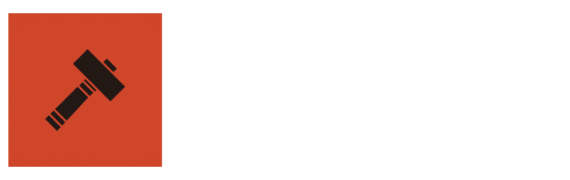
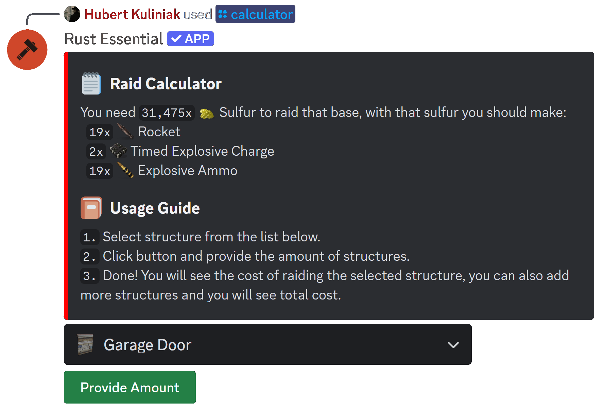
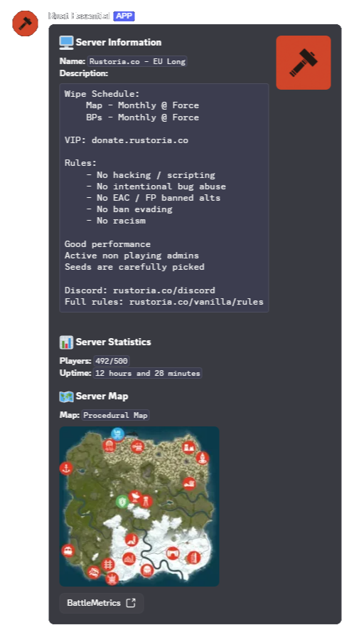

## About
Rust Essential is a project that provides many features like News, Raid Cost Calculator and more features that will be great for your Rust Community discord server.

## Features

- **/calculator**

    Calculator feature allows you to calculate cost of a raid in Rust. You can calculate cost of the raid by selecting structure type and then entering the number of that structures, then you receive how many resources you need for raid.

- **/serverinfo**

    Server Info feature allows you to get information about Rust server, e.g. server name, server description, amount of players, preview of server map and more.

